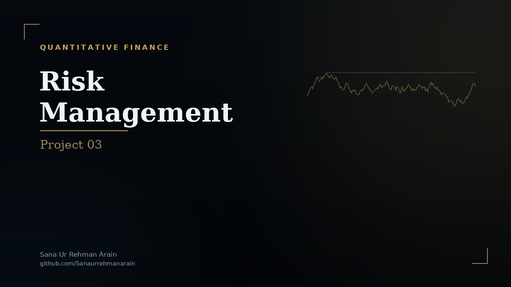

<div align="center">
  <a href="ProjectReport.pdf">
    
  </a>
  <p><em>Click the banner to view the full analysis report</em></p>
</div>

# 📈 Project 3: Interpretation of Results & Model Evaluation


## 📌 Project Overview

This repository contains the final evaluation and interpretation phase of the **Risk Management Mini-Capstone**. The objective is to assess the out-of-sample predictive performance of the Bayesian Network developed in the previous stages for forecasting the directional movement of WTI Crude Oil prices.

The emphasis of this project is on **model validation**, **forecast evaluation**, and **financial interpretation**, ensuring that predictive performance is assessed under realistic market conditions while minimizing common sources of statistical bias.

---

## 🧠 Validation Framework

To prevent look-ahead bias and reduce the risk of overfitting, the complete dataset was partitioned chronologically using an **80/10/10 split**.

### Training Set (80%)

The training dataset was used to:

- Learn the Bayesian Network structure
- Estimate Conditional Probability Tables (CPTs)
- Fit model parameters

### Validation Set (10%)

The validation dataset was reserved for:

- Hyperparameter tuning
- Model selection
- Bayesian Information Criterion (BIC) evaluation

### Testing Set (10%)

The final testing dataset consisted of an unseen **32-month out-of-sample period**, representing realistic macroeconomic conditions.

This dataset remained completely isolated during model development, providing an unbiased estimate of forecasting performance.

---

## 📊 Model Performance

The Bayesian Network was evaluated on the unseen testing period without access to future observations.

### Predictive Accuracy

The model achieved an out-of-sample directional forecasting accuracy of:

**62.5%**

Although modest in absolute terms, this exceeds the 50% benchmark expected from random directional guessing and demonstrates measurable predictive capability under real market conditions.

---

### Classification Performance

Model performance was further evaluated using a confusion matrix to assess its ability to distinguish between positive and negative market movements.

The model successfully identified multiple periods of market contraction, improving its usefulness as a risk management tool rather than solely a return-maximization model.

Performance metrics considered include:

- Overall Accuracy
- Confusion Matrix
- True Positives
- True Negatives
- False Positives
- False Negatives

---

### Risk Management Perspective

Rather than attempting to predict exact price levels, the Bayesian Network focuses on identifying the probability of favorable versus unfavorable market conditions.

A simple investment strategy was evaluated in which the portfolio remained invested during favorable market states and shifted to cash when elevated downside risk was predicted.

Compared with a passive Buy-and-Hold benchmark, the strategy demonstrated:

- Reduced exposure during adverse market conditions
- Improved downside protection
- Lower portfolio drawdowns
- Potential improvement in risk-adjusted performance (e.g., Sharpe Ratio)

These findings illustrate how probabilistic forecasting models may support portfolio risk management and tactical asset allocation.

---

## 📈 Key Evaluation Techniques

- Out-of-Sample Testing
- Chronological Train/Validation/Test Splitting
- Bayesian Network Inference
- Confusion Matrix Analysis
- Classification Accuracy
- Risk-Adjusted Performance Evaluation
- Portfolio Drawdown Analysis
- Quantitative Risk Management

---

## 📦 Requirements

- Python 3.8+
- pandas
- numpy
- scipy
- matplotlib
- scikit-learn
- pgmpy
- statsmodels

Install dependencies using:

```bash
pip install -r requirements.txt
```

---

## 🚀 How to Run the Project

### 1. Clone the Repository

```bash
git clone https://github.com/sanaurrehmanarain/oil-price-pgm.git
cd oil-price-pgm
```

### 2. Install Dependencies

```bash
pip install -r requirements.txt
```

### 3. Execute the Notebook

Launch the notebook:

```bash
jupyter notebook Notebook.ipynb
```

or open `Notebook.ipynb` directly in **VS Code** and run all cells.

The notebook will:

- Load the trained Bayesian Network
- Perform out-of-sample inference
- Generate prediction probabilities
- Evaluate classification performance
- Produce confusion matrices and performance metrics
- Compare model predictions against observed market outcomes

---

## 🎓 Academic Context

This project represents the final evaluation stage of a graduate-level quantitative risk management capstone.

The work focuses on applying probabilistic machine learning techniques to commodity market forecasting while emphasizing rigorous model validation, statistical integrity, and financial interpretability.

In addition to evaluating forecasting performance, the project includes a critical review of Danish A. Alvi's (2018) dissertation, examining contributions related to Bayesian econometrics, Black-Litterman portfolio optimization, and the application of Markov Blankets for dimensionality reduction within financial modeling.

---

## Copyright Notice

© 2026 Sana Ur Rehman Arain. All rights reserved.

This project is proprietary and is **not open source**.

You may view and run this project for personal, educational, and
reference purposes only. Copying, modifying, redistributing, sublicensing,
or creating derivative works — in whole or in part — is prohibited without
prior written permission from the copyright holder.

This project is provided "as is," without warranty of any kind.

For permission requests, contact: <sana.arain.work@gmail.com>

See the [LICENCE](LICENCE) file for the complete license terms.

---

## Citation

If permission is granted to use this project in academic research,
publications, educational materials, or derivative works, please retain
the original copyright notice and provide appropriate credit.

This repository includes a `CITATION.cff` file, so GitHub provides a
**"Cite this repository"** button in the repository sidebar, which you
can use to obtain citations in BibTeX, APA, and other supported formats.

**Suggested citation:**

Arain, S. U. R. (2026). oil-price-pgm (Version 1.0) [Software].
<https://github.com/sanaurrehmanarain/oil-price-pgm>

**Author:** Sana Ur Rehman Arain

**Profession:** Data Scientist

**GitHub:** <https://github.com/sanaurrehmanarain>