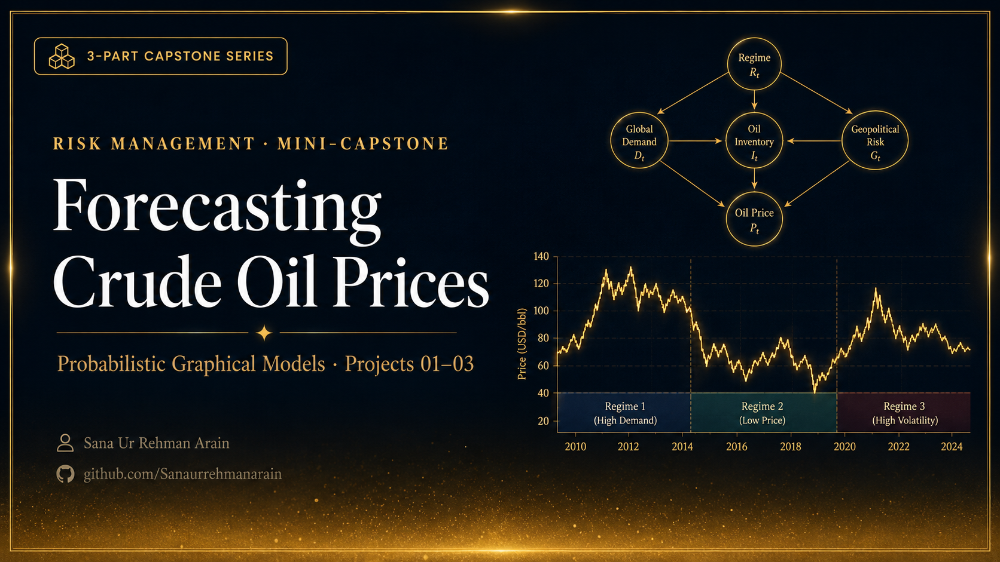

<p align="center">
  
</p>

# 🛢️ RISK MANAGEMENT MINI-CAPSTONE: FORECASTING CRUDE OIL PRICES USING PROBABILISTIC GRAPHICAL MODELS


---

## 📌 Project Overview

This repository contains a graduate-level **Risk Management Mini-Capstone** exploring the application of **Probabilistic Graphical Models (PGMs)** and **Hidden Markov Models (HMMs)** for forecasting the directional movement of **West Texas Intermediate (WTI) Crude Oil** prices.

Unlike traditional forecasting approaches that rely primarily on linear assumptions, this project combines probabilistic machine learning with macroeconomic analysis to model nonlinear market dynamics, latent volatility regimes, and probabilistic dependencies among economic indicators.

The capstone emphasizes both **predictive performance** and **model interpretability**, demonstrating how regime-switching models and Bayesian inference can support financial forecasting and portfolio risk management.

---

# 📚 Repository Structure

This repository is organized into three sequential projects representing the complete machine learning workflow.

---

## 📘 Project 1 — Problem Formulation & Data Collection

Focuses on defining the forecasting problem and constructing a robust macroeconomic dataset.

Topics covered include:

- Problem formulation
- Data engineering
- Automated API data collection
- Feature selection
- Missing-value handling
- Stationarity transformations
- Exploratory Data Analysis (EDA)

Primary technologies:

- FRED API
- Yahoo Finance API
- pandas
- statsmodels

---

## 📗 Project 2 — Methodology Description & Model Development

Develops the probabilistic forecasting framework.

Topics covered include:

- Hidden Markov Models (HMMs)
- Gaussian HMM regime detection
- Baum-Welch training
- Viterbi decoding
- Bayesian Network structure learning
- Hill Climb Search
- Bayesian Information Criterion (BIC)
- Markov Blanket discovery
- Bayesian parameter estimation

Primary technologies:

- hmmlearn
- pgmpy
- NumPy
- SciPy

---

## 📙 Project 3 — Interpretation of Results & Improving the Model

Evaluates forecasting performance under realistic market conditions.

Topics covered include:

- Chronological train/validation/test splitting
- Out-of-sample testing
- Bayesian inference
- Confusion Matrix analysis
- Risk-adjusted portfolio interpretation
- Model evaluation
- Research discussion and conclusions

---

# 🧠 Modeling Pipeline

The complete workflow consists of the following stages:

```
Macroeconomic Data Collection
            │
            ▼
Data Cleaning & Feature Engineering
            │
            ▼
Stationarity Transformation
            │
            ▼
Exploratory Data Analysis
            │
            ▼
Hidden Markov Model
(Regime Identification)
            │
            ▼
Bayesian Network
(Structure Learning)
            │
            ▼
Markov Blanket Discovery
            │
            ▼
Probabilistic Inference
            │
            ▼
Out-of-Sample Forecast Evaluation
```

---

# 📊 Data Sources

Macroeconomic and financial variables were collected from:

- Federal Reserve Economic Data (FRED)
- Yahoo Finance

The dataset spans **January 2000 to the present** using a Monthly-Start (`MS`) frequency.

Variables include:

- WTI Crude Oil Spot Price
- Industrial Production Index
- Capacity Utilization (Oil & Gas)
- Energy CPI
- S&P 500 Index
- US Dollar Index
- Energy Select Sector SPDR Fund (XLE)

---

# 📈 Machine Learning Techniques

- Hidden Markov Models
- Bayesian Networks
- Probabilistic Graphical Models
- Markov Blanket Discovery
- Bayesian Inference
- Variable Elimination
- Time-Series Analysis
- Regime Switching
- Financial Feature Engineering
- Stationarity Testing

---

# 📦 Requirements

- Python 3.8+
- pandas
- numpy
- scipy
- matplotlib
- statsmodels
- scikit-learn
- yfinance
- fredapi
- hmmlearn
- pgmpy
- python-dotenv

Install dependencies using:

```bash
pip install -r requirements.txt
```

---

# 🚀 Running the Project

1. Clone the repository.

```bash
git clone https://github.com/sanaurrehmanarain/oil-price-pgm.git
cd oil-price-pgm
```

2. Install dependencies.

```bash
pip install -r requirements.txt
```

3. Create a `.env` file.

```text
FRED_API_KEY=your_api_key
```

4. Execute the notebooks in sequence:

- Project 1
- Project 2
- Project 3

Each project builds upon the outputs generated by the previous stage.

---

# 🎓 Academic Context

This capstone demonstrates the application of probabilistic machine learning techniques within quantitative finance and risk management.

Rather than focusing solely on predictive accuracy, the project emphasizes:

- interpretable machine learning,
- statistically rigorous model validation,
- macroeconomic reasoning,
- and practical portfolio risk management applications.

The work integrates concepts from financial econometrics, Bayesian statistics, time-series modeling, and machine learning into a single end-to-end forecasting framework.

---

## Copyright Notice

© 2026 Sana Ur Rehman Arain. All rights reserved.

This project is proprietary and is **not open source**.

You may view and run this project for personal, educational, and
reference purposes only. Copying, modifying, redistributing, sublicensing,
or creating derivative works — in whole or in part — is prohibited without
prior written permission from the copyright holder.

This project is provided "as is," without warranty of any kind.

For permission requests, contact: <sana.arain.work@gmail.com>

See the [LICENCE](LICENCE) file for the complete license terms.

---

## Citation

If permission is granted to use this project in academic research,
publications, educational materials, or derivative works, please retain
the original copyright notice and provide appropriate credit.

This repository includes a `CITATION.cff` file, so GitHub provides a
**"Cite this repository"** button in the repository sidebar, which you
can use to obtain citations in BibTeX, APA, and other supported formats.

**Suggested citation:**

Arain, S. U. R. (2026). oil-price-pgm (Version 1.0) [Software].
<https://github.com/sanaurrehmanarain/oil-price-pgm>

**Author:** Sana Ur Rehman Arain

**Profession:** Data Scientist

**GitHub:** <https://github.com/sanaurrehmanarain>
